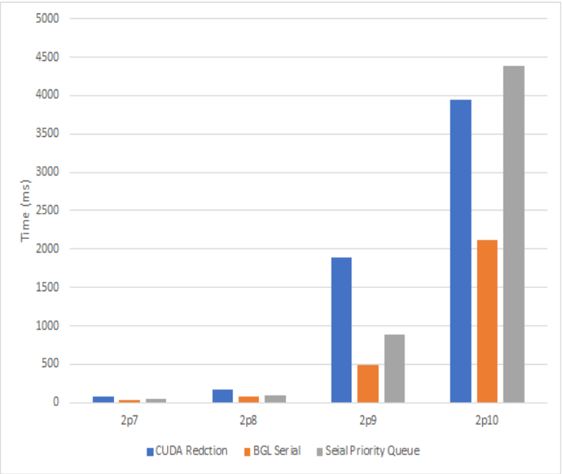
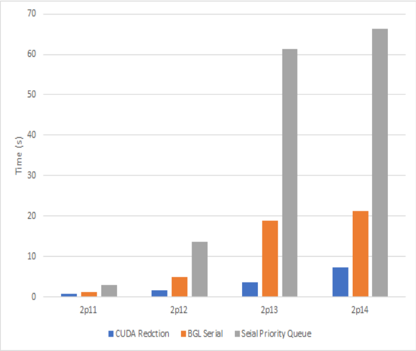

# GPU Based Fast Minimum Spanning Tree

## Usage
1. Random Connected Graph Generation
    ```
    $ g++ random_graph_generator.cpp -o graph
    $ ./graph > graph2p14
    16384
    ```

2. MST Serial
    ```
    $ g++ mst_serial.cpp -o serial
    $ ./serial < graph2p14
    ```

3. MST Serial BGL
    ```
    $ g++ mst_serial_bg;.cpp -o bgl
    $ ./bgl < graph2p14
    ```

4. Parallel CUDA code
    ```
    $ nvcc mst.cu -o mst
    $ ./mst < graph2p14
    ```

## Results



## Files
- `mst.cu` - CUDA code for parallel implementation of Prim's algorithm for MST
- `mst_serial_bgl.cc` - Serial code for Prim's MST using Boost Graph Library
- `mst_serial.cc` - Serial code for Prim's MST using Priority Queue
- `random_graph_generator.cpp` - Creation of random connected Graph

## References
Papers 
- `GPU_based_mst.pdf`
- `GPU_based_prims.pdf`